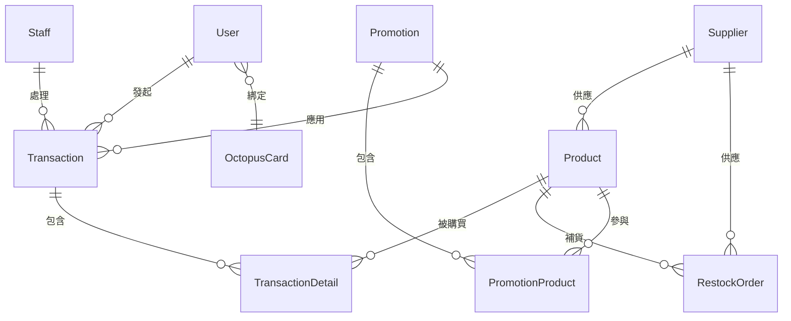

# 小食部管理系統數據庫（Canteen Management System Database）

本專案為學校小食部管理系統的數據庫設計與數據初始化腳本，包含數據庫結構、示例數據插入及常用查詢語句。

---

## 項目簡介

本項目旨在為學校小食部提供一套完整的數據庫解決方案，涵蓋用戶管理、產品管理、交易記錄、促銷活動、補貨流程等核心業務場景，支持日常運營與數據分析。

---

## 要求
- MySQL 8+
- SQL 標準語法
- Python3（用於批量數據生成）

---

## 文件說明

### 1. `ICT_SBA_Canteen_db_schema_init.sql`
- **用途**：初始化小食部管理系統的數據庫結構。
- **內容**：
  - 創建數據庫 `canteen_management`。
  - 創建主要業務表格，包括：
    - `User`（用戶/學生/教師/職員）
    - `OctopusCard`（八達通卡）
    - `Staff`（職員）
    - `Supplier`（供應商）
    - `Product`（產品）
    - `Promotion`（促銷活動）
    - `PromotionProduct`（促銷產品關聯）
    - `Transaction`（交易）
    - `TransactionDetail`（交易明細）
    - `RestockOrder`（補貨訂單）
  - 設置外鍵約束與索引以保證數據一致性與查詢效率。

### 2. `ICT_SBA_Data_Insert.sql`
- **用途**：插入示例數據，便於測試和演示。
- **內容**：
  - 為每個表格插入多條真實場景下的測試數據。
  - 包含學生、教師、職員、產品、供應商、促銷、交易、補貨等多維度數據。

### 3. `ICT_SBA_Select.sql`
- **用途**：常用查詢語句示例，便於數據分析與報表生成。
- **內容**：
  - 日銷售統計、毛利率計算
  - 最暢銷產品排名
  - 按年級統計學生消費情況
  - 其他業務相關查詢

### 4. `Sample_Generater` 目錄
- **用途**：包含用於生成大量樣本數據的 Python 腳本，每個表格有獨立的腳本。
- **主要文件**：
  - `generate_all_data.py` - 主腳本，運行所有表格的數據生成腳本
  - 各表格獨立腳本 - 為每個表格生成 1000 條樣本數據

---

## 數據庫結構（ER 圖）



---

## 主要功能亮點
- 支持學生、教師、職員多角色管理
- 八達通卡綁定與餘額管理
- 產品分類、庫存與補貨自動提醒
- 促銷活動自動生成與關聯
- 日銷售、毛利、暢銷/滯銷產品統計
- 支持批量數據生成與測試

---

## 使用方法

### 1. 初始化數據庫

```bash
mysql -u <用戶名> -p < ICT_SBA_Canteen_db_schema_init.sql
```

### 2. 插入示例數據

```bash
mysql -u <用戶名> -p < ICT_SBA_Data_Insert.sql
```

### 3. 執行常用查詢

```bash
mysql -u <用戶名> -p < ICT_SBA_Select.sql
```

### 4. 生成批量樣本數據（可選）

```bash
cd Sample_Generater
python generate_all_data.py
```

---

## 目錄結構

```
ICT_SBA_Canteen_db_schema_init.sql   # 數據庫結構初始化腳本
ICT_SBA_Data_Insert.sql              # 示例數據插入腳本
ICT_SBA_Select.sql                   # 常用查詢語句腳本
Readme.md                            # 項目說明文件
Sample_Generater/                    # 批量數據生成腳本
```


---

## License

本項目僅供香港中學文憑試（HKDSE）資訊及通訊科技（ICT）SBA 學術學習與參考用途，嚴禁直接抄襲、商業用途或未經授權的分發。請尊重原創，僅作個人學習、研究及參考設計之用。如需引用，請標明來源。

---
